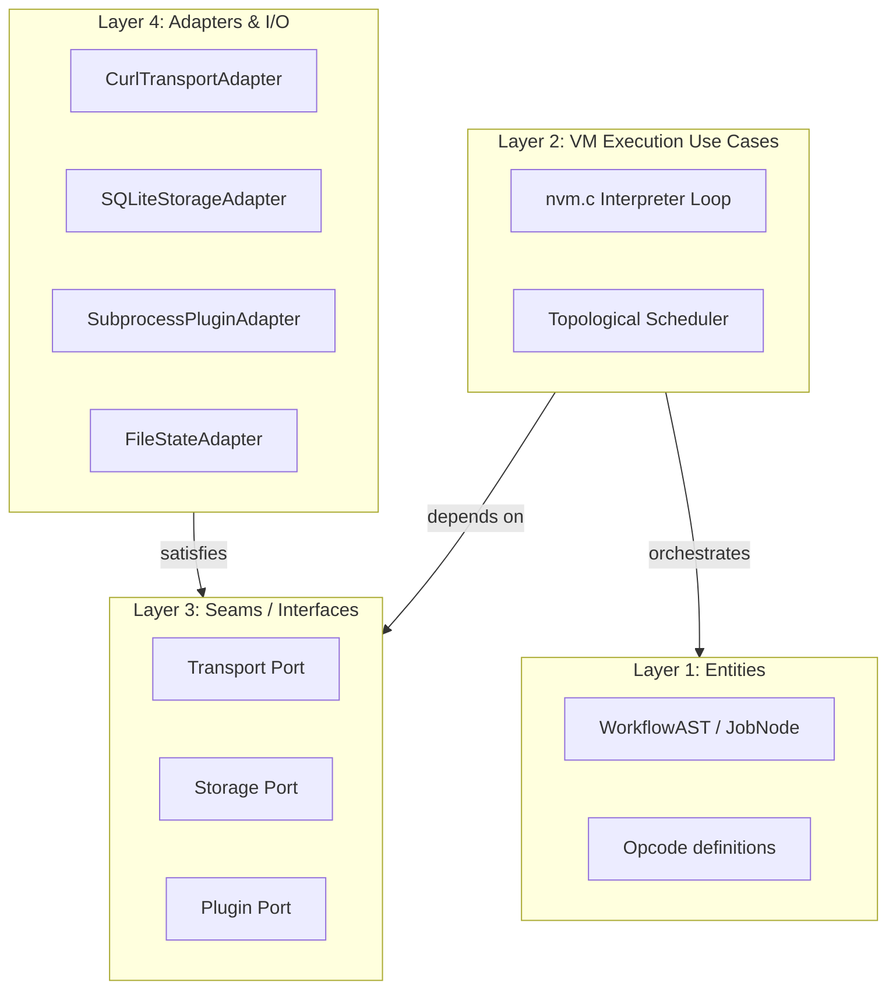

# Nestor Architecture Proposal: Clean & Hexagonal VM Design

This document details the architectural blueprint for scaling Nestor to professional production settings. It outlines the transition toward a **Clean & Hexagonal (Ports & Adapters)** architecture implemented in high-performance C, and summarizes the immediate refactoring opportunities to deepen the current codebase.

---

## 1. Architectural Philosophy & Layering

In a production setting, Nestor's core value is its deterministic, high-performance execution graph engine. To ensure modularity, maintainability, and simple testability, dependencies must flow strictly inward. Outer infrastructure concerns (networking, SQLite databases, file systems) must never infect the core virtual machine execution logic.



### Layer 1: Core Domain Entities (Inner-most)
*   **Definitions**: [`ast.h`](file:///Users/sebastientraber/Documents/Prog/c/nestor/.worktrees/json-validation-jsonv/src/include/ast.h), `opcodes.h`.
*   **Responsibility**: Defines the syntax tree representation (`WorkflowAST`, `JobNode`, `StepNode`) and VM instructions.
*   **Invariants**: This layer is stateless, cache-local, and has **zero dependencies** on external libraries, SQLite, or system I/O headers.

### Layer 2: Core VM Engine (Use Cases)
*   **Definitions**: [`nvm.c`](file:///Users/sebastientraber/Documents/Prog/c/nestor/.worktrees/json-validation-jsonv/src/comm/struct/nvm.c), `scheduler.c`.
*   **Responsibility**: Orchestrates step execution flow, loops, and parallel execution logic. It depends *only* on Layer 1 and the abstract **Ports** defined in Layer 3.
*   **Locality**: All execution rules and step scheduling bugs concentrate here, completely shielded from external I/O failures.

### Layer 3: Ports (The Seams)
*   **Definitions**: `transport.h`, `storage.h`, `plugin.h`.
*   **Responsibility**: Defines the abstract **seams** of the system.
*   **Implementation**: Statically defined interface tables containing function signatures and opaque pointers to hide state.

### Layer 4: Adapters (Infrastructure - Outer-most)
*   **Definitions**: [`transport.c`](file:///Users/sebastientraber/Documents/Prog/c/nestor/.worktrees/json-validation-jsonv/src/comm/struct/transport.c), [`cache.c`](file:///Users/sebastientraber/Documents/Prog/c/nestor/.worktrees/json-validation-jsonv/src/comm/struct/cache.c), [`plugin.c`](file:///Users/sebastientraber/Documents/Prog/c/nestor/.worktrees/json-validation-jsonv/src/comm/struct/plugin.c).
*   **Responsibility**: Concrete **adapters** satisfying the ports. This is where third-party libraries (libcurl, sqlite3) are imported and compiled.

---

## 2. Port & Adapter Implementation Patterns in C

Unlike object-oriented languages, C does not have native interface types. Instead, we implement Hexagonal Ports and Adapters using **Structs of Function Pointers** and **Opaque Context Pointers** (`void*`).

### Pattern A: Interface Operations (Port)
Each Port defines a v-table struct (`Ops`) and a wrapping context struct that callers pass around:

```c
// include/storage.h
typedef struct Storage Storage;
typedef struct StorageOps StorageOps;

struct StorageOps {
  int32_t (*load_state)(Storage *s, Arena *arena, const char *wf_name, Jsonv_Value *out_state);
  int32_t (*save_state)(Storage *s, Arena *arena, const char *wf_name, Jsonv_Value state);
  int32_t (*get_cached_job)(Storage *s, Arena *arena, const char *key, Jsonv_Value *out_outcome);
  int32_t (*put_cached_job)(Storage *s, Arena *arena, const char *key, Jsonv_Value outcome);
};

struct Storage {
  const StorageOps *ops;
  void *impl_data; // Opaque adapter context pointer
};
```

### Pattern B: Concrete Implementation (Adapter)
The adapter file implements the function pointers and manages its own internal state context. The caller only interacts with the `Storage` struct:

```c
// struct/sqlite_storage.c
#include "storage.h"
#include <sqlite3.h>

typedef struct {
  sqlite3 *db_conn;
  char lock_file_path[256];
} SQLiteStorageImpl;

static int32_t sqlite_load_state(Storage *s, Arena *arena, const char *wf_name, Jsonv_Value *out_state) {
  SQLiteStorageImpl *impl = (SQLiteStorageImpl *)s->impl_data;
  // Concrete implementation using sqlite3_prepare_v2...
  return ERR_SUCCESS;
}

static const StorageOps sqlite_ops = {
  .load_state = sqlite_load_state,
  // ...
};

Storage *storage_sqlite_new(Arena *arena, const char *db_path) {
  SQLiteStorageImpl *impl = na_alloc(arena, sizeof(SQLiteStorageImpl));
  if (!impl) return NULL;
  // Initialize SQLite connection...
  
  Storage *s = na_alloc(arena, sizeof(Storage));
  s->ops = &sqlite_ops;
  s->impl_data = impl;
  return s;
}
```

---

## 3. Current Architecture Improvement Candidates

To move Nestor toward this modular ideal, the following refactoring candidates have been identified to turn **shallow** procedural modules into **deep** modular abstractions:

### Candidate 1: Collapse Caching and State Persistence (Storage Seam)
*   **Strength**: **Strong** | **Category**: `ports & adapters`
*   **Files**: [`src/comm/struct/nvm.c`](file:///Users/sebastientraber/Documents/Prog/c/nestor/.worktrees/json-validation-jsonv/src/comm/struct/nvm.c), [`src/comm/struct/runner.c`](file:///Users/sebastientraber/Documents/Prog/c/nestor/.worktrees/json-validation-jsonv/src/comm/struct/runner.c), [`src/comm/struct/cache.c`](file:///Users/sebastientraber/Documents/Prog/c/nestor/.worktrees/json-validation-jsonv/src/comm/struct/cache.c)
*   **Friction**: State serialization (`save_tfstate`), file locking, and SQLite cache reads (`check_and_apply_cache`) are currently procedurally linked in `runner.c`. Invariants like file lock handles and SQL queries leak directly into the NVM orchestration runner.
*   **Deepening**: Consolidate `.tfstate` files and SQLite cache queries behind a single `Storage` interface. The implementation handles file descriptors, database schemas, and transactions.
*   **Wins**:
    *   *locality*: database schemas and locking loops concentrate in one file.
    *   *leverage*: NVM calls one clean storage interface; test suite swaps it for an in-memory mock storage adapter.

### Candidate 2: Deepen Variable Scope Management
*   **Strength**: **Worth exploring** | **Category**: `in-process`
*   **Files**: [`src/comm/struct/nvm.c`](file:///Users/sebastientraber/Documents/Prog/c/nestor/.worktrees/json-validation-jsonv/src/comm/struct/nvm.c), [`src/comm/struct/runner.c`](file:///Users/sebastientraber/Documents/Prog/c/nestor/.worktrees/json-validation-jsonv/src/comm/struct/runner.c), [`src/comm/utils/evaluator.c`](file:///Users/sebastientraber/Documents/Prog/c/nestor/.worktrees/json-validation-jsonv/src/comm/utils/evaluator.c)
*   **Friction**: Variable scoping is evaluated procedurally at runtime. Callers must manually push/pop JSON structures to build scope stacks, which leaks JSON context layouts and risks scoping/visibility corruption.
*   **Deepening**: Abstract variable resolution under a `VariableScope` interface. The implementation manages the scoping stack, search order, and visibility (`public` vs `private`) checks internally.
*   **Wins**:
    *   *locality*: scope traversal bugs concentrate inside the VariableScope module.
    *   *leverage*: clean push/pop interfaces replace manual JSON mutations.

### Candidate 3: Deepen Network Transport Responses
*   **Strength**: **Speculative** | **Category**: `ports & adapters`
*   **Files**: [`src/comm/struct/transport.c`](file:///Users/sebastientraber/Documents/Prog/c/nestor/.worktrees/json-validation-jsonv/src/comm/struct/transport.c), [`src/include/response_buffer.h`](file:///Users/sebastientraber/Documents/Prog/c/nestor/.worktrees/json-validation-jsonv/src/include/response_buffer.h), [`src/comm/struct/runner.c`](file:///Users/sebastientraber/Documents/Prog/c/nestor/.worktrees/json-validation-jsonv/src/comm/struct/runner.c)
*   **Friction**: `ResponseBuffer` leaks raw memory pointers and file descriptors (`stream_fd`) directly to `runner.c`, forcing the runner to manually open/close streaming files and handle buffer lifecycles.
*   **Deepening**: Redesign the transport layer response interface to return a deep `Response` module. Callers retrieve the parsed body or headers via clear interface methods, hiding stream file lifecycles.
*   **Wins**:
    *   *locality*: file descriptor lifetimes and raw memory boundaries concentrate in the transport adapter.
    *   *leverage*: parsed yaml/json bodies and headers are retrieved without exposing internals.

---

## 4. Architectural Stepping Stones

Implementing the candidates above acts as direct stepping stones to achieve the Clean & Hexagonal vision:
1.  **Introduce the Storage Seam**: Implementing Candidate 1 immediately isolates SQLite and file systems from NVM, decoupling Layer 2 and Layer 4 for storage.
2.  **Encapsulate Scope State**: Implementing Candidate 2 simplifies the NVM execution loop by removing variable-binding procedural logic, making NVM compile cleaner.
3.  **Encapsulate Transport State**: Implementing Candidate 3 completes the decoupling of Layer 4 networking, ensuring NVM interacts only with deep network interfaces.
