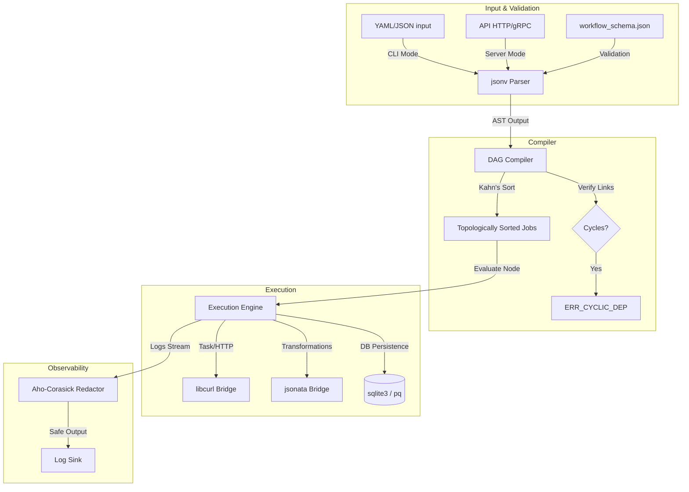

# Nestor Orchestration Engine: Technical Implementation Specification

---

## 1. System Architecture Overview

Nestor is implemented in pure C for minimal overhead, zero-copy parsing, and absolute memory efficiency.



---

## 2. Memory Management & Zero-Copy Architecture

### 2.1 Chained Arena Allocator
All dynamic memory allocations in Nestor must use a custom **Chained Arena Allocator**. The use of standard library heap allocators (`malloc`, `free`, `realloc`, `calloc`) is strictly forbidden during execution.

```c
typedef struct ArenaChunk ArenaChunk;
struct ArenaChunk {
    uint8_t* memory;
    size_t capacity;
    size_t offset;
    ArenaChunk* next;
};

typedef struct {
    ArenaChunk* first;
    ArenaChunk* current;
    size_t default_chunk_size;
} Arena;
```

#### Arena Rules:
*   **Explicit Context Passing**: Every function requiring allocation must accept a pointer to the active `Arena` (e.g. `void* my_func(Arena* arena, ...)`).
*   **Graceful OOM Handling**: If a chunk allocation fails, the allocator returns `NULL`. The code must check for this, clean up resources, and gracefully propagate `ERR_OOM`.
*   **Single-Pass Deallocation**: Memory reclamation is done in bulk at iteration frame boundaries using `arena_reset`.

### 2.2 Zero-Copy String Views
String values (keys, URLs, expressions, bodies) are never duplicated during parsing or symbol extraction. Instead, they reference slices of the original input buffer using a length-delimited `StringView`:

```c
typedef struct {
    const char* data;  // Pointer directly to original input buffer
    size_t length;     // Character count (not null-terminated)
} StringView;
```

---

## 3. Dynamic Integration Bridges

### 3.1 `jsonv` (YAML/JSON Parser & Validator)
*   **Bridge Strategy**: Configure `jsonv` with custom allocators pointing to our `Arena` via callback wrappers to prevent standard heap allocation.
*   **Loader Verification**: The loader parses YAML files into a JSONv structure to inspect root keys. If a root key `"provider"` (of type string) is detected, the file is classified as a provider wrapper; otherwise, it is compiled as a workflow scenario.
*   **Dynamic Schema Compilation**: If `docs/workflow_schema.bin` does not exist or is modified, the parser automatically compiles `docs/workflow_schema.json` to binary bytecode.
*   **Parent Path Fallback**: If the schema files are not found in the current working directory, the parser falls back to checking `../docs/` and `../../docs/` directories to support execution from workspace subfolders.

### 3.2 `jsonata` (Query & Transformation Engine)
*   **Bridge Strategy**: Nestor instantiates a thread-local JSONata evaluation environment. It evaluates expressions enclosed in `${{ ... }}` by compiling the paths into a JSONata tree and evaluating them against the context scope.

### 3.3 `libcurl` (HTTP Transport)
*   **Bridge Strategy**: Utilizes curl's non-blocking `curl_multi` interface. In streaming step mode (`stream: true`), curl write callbacks dump received bytes to a file on disk in fixed chunks to avoid in-memory DOM allocations.

### 3.4 `sqlite3` (Event-Sourced Persistence & Cache Subsystem)
*   **Pruning & WAL**: Configured to run in WAL mode (`PRAGMA journal_mode=WAL;`).
*   **Eviction**: Eviction routines (TTL and LRU size pruning) are run inside single SQLite write transactions on every cache insertion.
*   **Bypass Overrides**: Caching is bypassed globally if `NESTOR_NO_CACHE=true` (CLI flag `--no-cache`), or individually at the job level if `cache: false` or if the job-level cache TTL expires.

### 3.5 Dynamic Link Plugins (Plugin SDK & Sandboxing)
*   **Sandboxed Subprocess**: If `sandboxed: true` is set, Nestor forks a helper subprocess runner (`nestor-plugin-runner`) to isolate dynamic library loading, catching segmentation faults and leaks before they reach the main host thread.
*   **Trusted Dynamic Loading**: If sandboxing is disabled, the plugin loads via `dlopen()`. Memory is allocated from the host-supplied `Arena*` using a double-pointer registration struct.

---

## 4. Intrusive Data Structures

To eliminate pointer indirection, Nestor embeds topological links directly within the job structures:

```c
typedef enum {
    NODE_TASK,
    NODE_IF,
    NODE_SWITCH,
    NODE_FORK,
    NODE_JOIN,
    NODE_LOOP,
    NODE_WAIT_SIGNAL,
    NODE_WAIT_TIMER,
    NODE_TRANSFORM,
    NODE_EXPORT
} NodeType;

struct JobNode {
    NodeType type;
    StringView id;
    StringView name;

    JobNode* next_sorted;  // topologically sorted linked list
    JobNode** depends_on_nodes;  // Resolved dependency pointers
    StringView* depends_on_ids;  // Raw dependency IDs
    uint8_t* depends_on_conditions; // Bitmask conditional edges
    size_t dependency_count;

    uint8_t execution_state; // PENDING, RUNNING, SUCCEEDED, FAILED, SKIPPED, SUSPENDED

    bool is_start;
    bool is_end;
    StringView return_expr;

    bool cache_enabled;
    bool has_cache_ttl;
    int32_t cache_ttl;

    union {
        struct {
            struct StepNode* steps_head;
        } task;

        struct {
            StringView expression;
        } transform;

        struct {
            StringView file_path;
            Jsonv_Value data_val;
        } export_node;

        struct {
            StringView condition;
            StringView* then_branch;
            size_t then_count;
            StringView* else_branch;
            size_t else_count;
        } binary_if;

        // Multi-case switch, loop, join, and wait structures...
    } spec;
};
```

---

## 5. Execution Engine & State Machine

### 5.1 Bit-Packed State Stack
Tracks nested iterations and execution loops without memory allocation by compressing indexes and conditions into single `uint64_t` registers:

```c
typedef struct {
    uint64_t* data;
    size_t top;
    size_t capacity;
} BitStack;
```

### 5.2 Scoped Variable Resolution
*   **Evaluation Context**: During execution, the runner builds a virtual JSON context containing `inputs`, `env`, `secrets`, `needs`, `steps`, and `providers`.
*   **Lexical Scoping**: Evaluated using `push_local_vars` and `pop_local_vars` dynamically. Private variables are cleared at job completion and bypassed during state serialization.
*   **Outcome Projection**: If step-level `outputs` are configured, the projected values are evaluated, and the parent response body is instantly freed from the arena.

### 5.3 Export Job Execution
*   When executing an `export` job, the runner evaluates the file path string (using `resolve_string`) and the data structure (using `resolve_json_value`), serializes the data to JSON format, and writes it directly to disk.

---

## 6. Security & Secret Redaction (Aho-Corasick)
Any standard output or logging string generated during execution passes through an inline Aho-Corasick matching trie. Sensitive keys/values loaded in the context are compiled into the state machine, and matches are redacted in-place (`***`) in zero-allocation buffers.

---

## 7. Error Handling & Propagation
All routines return signed `int32_t` status codes:
*   `ERR_SUCCESS` (`0`): Execution completed successfully.
*   `ERR_OOM` (`-1`): Arena allocation failed or stack overflow occurred.
*   `ERR_CYCLIC_DEP` (`-2`): Cyclic dependency in variable/graph compilation.
*   `ERR_MISSING_VAR` (`-3`): Expression evaluated to null for a required key.
*   `ERR_CLI_UNSUPPORTED_BLOCKING_NODE` (`-4`): Suspended state gate hit in stateless CLI.
*   `ERR_LOOP_MAX_ITERATIONS` (`-5`): Loop exceeded maximum iteration threshold.
*   `ERR_HTTP_TRANSPORT` (`-6`): Request timed out or failed to connect.
*   `ERR_INVALID_BOUNDARY` (`-7`): Start/end graph boundary violations.
*   `ERR_LOCKED` (`-8`): State backend lock file active.
