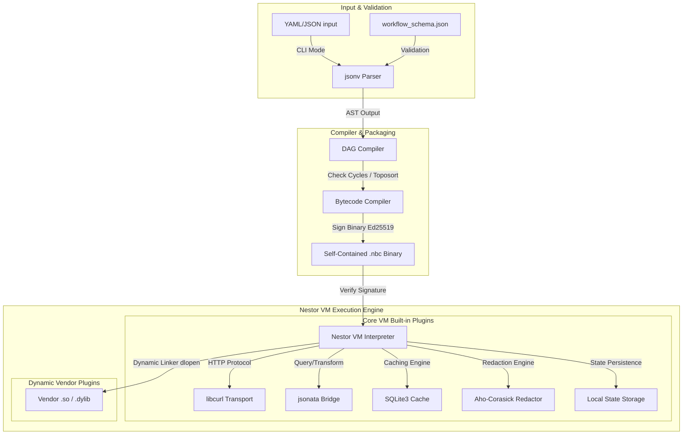

# Nestor Orchestration Engine: Technical Implementation Specification

---

## 1. System Architecture Overview

Nestor is implemented in pure C for minimal overhead, zero-copy parsing, and absolute memory efficiency. Workflows are compiled into a highly portable, self-contained bytecode format (`.nbc`) and executed on the Nestor Virtual Machine (NVM).



---

## 2. Memory Management & Zero-Copy Architecture

### 2.1 Chained Arena Allocator
All dynamic memory allocations in Nestor must use a custom **Chained Arena Allocator**. The use of standard library heap allocators (`malloc`, `free`, `realloc`, `calloc`) is strictly forbidden during execution.

```c
typedef struct ArenaChunk ArenaChunk;
struct ArenaChunk {
    uint8_t* memory;
    size_t capacity;
    size_t offset;
    ArenaChunk* next;
};

typedef struct {
    ArenaChunk* first;
    ArenaChunk* current;
    size_t default_chunk_size;
} Arena;
```

#### Arena Rules:
*   **Explicit Context Passing**: Every function requiring allocation must accept a pointer to the active `Arena` (e.g. `void* my_func(Arena* arena, ...)`).
*   **Graceful OOM Handling**: If a chunk allocation fails, the allocator returns `NULL`. The code must check for this, clean up resources, and gracefully propagate `ERR_OOM`.
*   **Single-Pass Deallocation**: Memory reclamation is done in bulk at iteration frame boundaries using `arena_reset`.

### 2.2 Zero-Copy String Views
String values (keys, URLs, expressions, bodies) are never duplicated during parsing or symbol extraction. Instead, they reference slices of the original input buffer using a length-delimited `StringView`:

```c
typedef struct {
    const char* data;  // Pointer directly to original input buffer
    size_t length;     // Character count (not null-terminated)
} StringView;
```

---

## 3. Modular Plugin Architecture

Nestor is decoupled into a lightweight VM core and registered plugins conforming to a standard interface:

```c
typedef struct {
  const char *name;
  int32_t (*execute)(Arena *arena, HostContext *host_ctx, Jsonv_Value args, Jsonv_Value *out_res);
} NestorPlugin;
```

### 3.1 Built-in Core Plugins
Built-in plugins are statically compiled within the Nestor executable:
*   **`http` (Transport Protocol)**: Utilizes curl's non-blocking `curl_multi` interface. In streaming mode (`stream: true`), curl write callbacks dump bytes directly to disk in fixed chunks to avoid in-memory allocations.
*   **`transform` & `jsonata` (Query Engine)**: Instantiates a thread-local JSONata evaluation environment. Resolves expressions enclosed in `${{ ... }}`.
*   **`cache` (Cache Subsystem)**: Configured in WAL mode (`PRAGMA journal_mode=WAL;`). Performs TTL and LRU size pruning inside single SQLite write transactions. Bypassed if `NESTOR_NO_CACHE=true`.
*   **`redactor` (Observability Redaction)**: Matches sensitive keys/values against an inline Aho-Corasick trie, redacting matches in-place (`***`) in zero-allocation buffers.
*   **`state` (State Storage & Locking)**: Reads and persists state records to local `.tfstate` files and handles `.lock` verification.

### 3.2 Dynamic Vendor Plugins
*   **Dynamic Loading**: Dynamic vendor plugins are loaded at runtime from a local directory (e.g., `./plugins/plugin_name.so`) via `dlopen()` and `dlsym()`.
*   **Sandboxing Subprocess**: If `sandboxed: true` is configured in the plugin manifest, Nestor forks a helper subprocess runner (`nestor-plugin-runner`) to isolate dynamic library loading, preventing segfaults from crashing the main VM thread.

---

## 4. Default VM Execution Engine & Interpreter

NVM executes compiled bytecode sequences sequentially or concurrently using a stack-based model, fully decoupled from the original AST memory structures.

### 4.1 Compile-Once, Run-Everywhere Bundle Design
*   **Hermetic NBC Binary**: Workflows, sub-workflows, and declarative provider definitions are bundled into a single `.nbc` file. 
*   **Sub-workflows**: Compiled as distinct labeled blocks in the `Workflow/Function Table` and jumped to using `OP_CALL_WORKFLOW`.
*   **Providers**: Represented as reusable function blocks. Steps invoking them push arguments onto the stack and run `OP_CALL_PROVIDER`.
*   **Runtime Injection**: To maintain security, secrets and environment variables are not compiled into the bytecode. The VM resolves them dynamically using `OP_LOAD_ENV`.

### 4.2 Security & Signature Verification
*   **Ed25519 Signatures**: A 64-byte Ed25519 signature is embedded in the binary header. The host VM verifies the signature using a pre-configured public key before execution.
*   **Bailout**: If verification fails, NVM aborts immediately with `ERR_VM_ILLEGAL_INSTRUCTION`.
*   **Safety Limits**: Checks evaluate stack bounds (`ctx->sp < VM_STACK_LIMIT`) and ensure jump offsets remain within the code boundaries (`ctx->code_size`).

---

## 5. Tooling: Disassembler (`disassemble` subcommand)

To maintain code visibility, Nestor exposes a built-in `disassemble` (or `dis`) subcommand in the main binary to disassemble bytecode binaries into a readable assembly-like representation:

```bash
bin/main disassemble output.nbc
```

```assembly
; Source: workflow.yaml
; Signature: Valid (Ed25519)

.const_pool:
  [0] "API_KEY"
  [1] "user_id"

.code:
  0x0000: OP_LOAD_ENV       0            ; API_KEY
  0x05:   OP_PUSH_CONST     1            ; user_id
  0x0A:   OP_CALL_PROVIDER  "login"
  0x0F:   OP_RETURN
```

---

## 6. Error Handling & Propagation
All routines return signed `int32_t` status codes:
*   `ERR_SUCCESS` (`0`): Execution completed successfully.
*   `ERR_OOM` (`-1`): Arena allocation failed or stack overflow occurred.
*   `ERR_CYCLIC_DEP` (`-2`): Cyclic dependency in variable/graph compilation.
*   `ERR_MISSING_VAR` (`-3`): Expression evaluated to null for a required key.
*   `ERR_CLI_UNSUPPORTED_BLOCKING_NODE` (`-4`): Suspended state gate hit in stateless CLI.
*   `ERR_LOOP_MAX_ITERATIONS` (`-5`): Loop exceeded maximum iteration threshold.
*   `ERR_HTTP_TRANSPORT` (`-6`): Request timed out or failed to connect.
*   `ERR_INVALID_BOUNDARY` (`-7`): Start/end graph boundary violations.
*   `ERR_LOCKED` (`-8`): State backend lock file active.
*   `ERR_TRANSCODE` (`-9`): Data format transcoding failed.
*   `ERR_VM_ILLEGAL_INSTRUCTION` (`-10`): Invalid opcode or verification signature mismatch.

---

## 7. Multi-Format Transcoder Module

Nestor uses `Jsonv_Value` (the arena-allocated JSON DOM) as its **Unified Intermediate Representation**. Non-JSON inputs (CSV, XML, Form, Binary) are transcoded into JSON at the expression boundary and formatted back at the output boundary, maintaining high compatibility without opcode bloat.

### 7.1 Input Transcoders
*   `csv_to_json(Arena* arena, StringView data, CsvOptions opts)`: Scans line-by-line using zero-copy string views for cells.
*   `xml_to_json(Arena* arena, StringView data, XmlConvention conv)`: SAX-like scanner tracking tag nesting depth. Supports badgerfish and jsonml.
*   `form_to_json(Arena* arena, StringView data)`: Parses URL-encoded data.
*   `binary_decode(Arena* arena, StringView data, BinaryEncoding enc)`: Decodes base64 or hex into raw byte views.

### 7.2 Output Formatters
*   `json_to_csv()`, `json_to_xml()`, `json_to_form()`, and `binary_encode()` serialize JSON DOM structures back to the target format strings.
