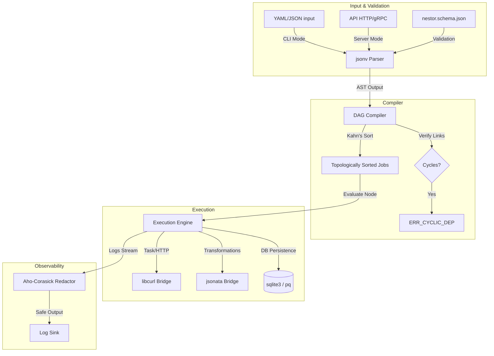

# nestor Orchestration Engine: Technical Implementation Specification

- **Version:** 2.0.0 (Final Draft)
- **Author:** Core Architecture Group
- **Subject:** System Design & Technical Specification for C-Based Implementation
- **Status:** Approved for Agent Implementation

---

## Table of Contents
1. [System Architecture Overview](#1-system-architecture-overview)
2. [Memory Management & Zero-Copy Architecture](#2-memory-management--zero-copy-architecture)
3. [Shared Library Integration & Bridges](#3-shared-library-integration--bridges)
4. [Data Representation & Intrusive Graph Structures](#4-data-representation--intrusive-graph-structures)
5. [JSONata Expression Engine Integration](#5-jsonata-expression-engine-integration)
6. [Execution Engine & State Machine](#6-execution-engine--state-machine)
7. [Network & Persistence (Server Mode Details)](#7-network--persistence-server-mode-details)
8. [Security & Secret Redaction (Aho-Corasick)](#8-security--secret-redaction-aho-corasick)
9. [Errors, OOM Handling & Propagation](#9-errors-oom-handling--propagation)

---

## 1. System Architecture Overview

The `nestor` engine is implemented in pure C, optimizing for low latency, zero-copy parsing, and absolute memory efficiency. 



---

## 2. Memory Management & Zero-Copy Architecture

### 2.1 Chained Arena Allocator
All dynamic memory allocations in `nestor` must use a custom **Chained Arena Allocator**. The use of standard library allocators (`malloc`, `calloc`, `realloc`, `free`) is strictly forbidden. 

```c
typedef struct ArenaChunk ArenaChunk;
struct ArenaChunk {
    uint8_t* memory;
    size_t capacity;
    size_t offset;
    ArenaChunk* next;
};

typedef struct {
    ArenaChunk* first;
    ArenaChunk* current;
    size_t default_chunk_size;
} Arena;
```

#### Arena Rules:
- **Explicit Context Passing:** Every function requiring dynamic allocation must accept a pointer to the active `Arena` (e.g., `void* my_func(Arena* arena, ...)`).
- **Graceful OOM Handling:** If an arena chunk fails to allocate from the OS, the allocator returns `NULL`. The engine must catch this, clean up resources, and gracefully bubble up an `ERR_OOM` code.
- **Single-Pass Deallocation:** Deallocation is done in bulk by clearing the entire arena chain (`arena_reset`), returning worker threads to clean states.

### 2.2 Zero-Copy String Views
String values (keys, URLs, expressions, bodies) are never duplicated during parsing or symbol extraction. Instead, the engine references slices of the original input buffer using a length-delimited `StringView`:

```c
typedef struct {
    const char* data;  // Pointer directly to original input buffer
    size_t length;     // Character count (not null-terminated)
} StringView;
```

---

## 3. Shared Library Integration & Bridges

Since external shared libraries utilize default allocators, the engine uses custom wrapper boundaries to prevent memory leaks and standard heap fragmentation.

### 3.1 `jsonv` (YAML/JSON Parser & Validator)
- **Purpose:** Parses input workflows into an AST and validates against the core JSON schema.
- **Bridge Strategy:** Configure `jsonv` with custom allocators pointing to our `Arena` via callback wrappers:
  ```c
  void* jsonv_arena_malloc(size_t size, void* user_data) {
      return arena_alloc((Arena*)user_data, size);
  }
  ```

### 3.2 `jsonata` (Query & Transformation Engine)
- **Purpose:** Evaluates expressions enclosed in `${{ ... }}`.
- **Bridge Strategy:** Instantiate a thread-local JSONata evaluation environment. Ensure all outputs returned by the transformation engine are either copied directly into our arena-controlled buffer or mapped immediately to `StringView` scopes.

### 3.3 `libcurl` & `libmicrohttpd` (HTTP Transport)
- **Purpose:** `libcurl` drives steps under `http` blocks; `libmicrohttpd` runs the API daemon.
- **Bridge Strategy:** Overwrite default memory management via `curl_global_init_mem` to direct cURL heap operations to a thread-local arena, or enforce strict cleanup scopes.

### 3.4 `sqlite3` & `libpq` (Event-Sourced Persistence & Cache Subsystem)
- **Purpose:** Persisting workflow state changes in Server Mode and managing the local cache.
- **Bridge & WAL Strategy:** Configure SQLite to use our memory allocator using `sqlite3_config(SQLITE_CONFIG_MALLOC, ...)`. Enable Write-Ahead Logging (`PRAGMA journal_mode=WAL;`) and configure a busy timeout of 5000ms using `sqlite3_busy_timeout` to prevent locking under parallel job execution.
- **Eviction Triggers:** Implement automated TTL cleanup and LRU size pruning queries running in single transactional blocks on every write.

### 3.5 Dynamic Link Plugins (Plugin SDK & Sandboxing)
- **Dynamic Loading:** Loads dynamic libraries (`.so`/`.dylib`) using `dlopen()` and resolves entry symbols using `dlsym()`.
- **Double-Pointer Register:** Enforces stable ABI by passing `NestorHostAPI` function pointer structures to the library and populating `NestorPluginAPI` structures returned by the plugin.
- **Memory Arena Hook:** Host passes active job `Arena*` to the plugin's execution call. The plugin must request memory using the host's allocation function pointer.
- **Sandboxing Execution:** If `"sandboxed": true` is set in the configuration, the engine wraps execution in an isolated helper subprocess wrapper via `fork()` + `execvp()`, communicating outcomes through stdout and catching segmentation/leak errors.


---

## 4. Data Representation & Intrusive Graph Structures

To eliminate pointer indirection overhead, `nestor` utilizes intrusive structures. Metadata links are embedded directly into job nodes rather than allocating auxiliary container structs.

```c
typedef enum {
    NODE_TASK,
    NODE_TRANSFORM,
    NODE_IF,
    NODE_SWITCH,
    NODE_FORK,
    NODE_JOIN,
    NODE_LOOP,
    NODE_WAIT_SIGNAL,
    NODE_WAIT_TIMER
} NodeType;

typedef struct JobNode JobNode;
struct JobNode {
    NodeType type;
    StringView id;
    StringView name;

    // Intrusive topological graph pointers
    JobNode* next_sorted;  // Linked list of topologically sorted jobs
    JobNode** depends_on;  // Array of upstream dependencies (allocated in Arena)
    uint8_t* depends_on_conditions; // Bitmask conditions for each dependency edge
    size_t dependency_count;

    // Bitwise state tracking
    uint8_t execution_state; // PENDING, RUNNING, SUCCEEDED, FAILED, SKIPPED, SUSPENDED

    // Boundary configuration properties
    bool is_start;
    bool is_end;
    StringView return_expr;

    union {
        struct {
            struct StepNode* steps_head; // Intrusive step linked list
        } task;

        struct {
            StringView expression; // JSONata expression for transform
        } transform;


        struct {
            StringView condition;
            StringView* then_branch;   // Downstream job IDs
            size_t then_count;
            StringView* else_branch;   // Downstream job IDs
            size_t else_count;
        } binary_if;

        struct {
            struct SwitchCase* cases;  // Intrusive switch case list
            size_t case_count;
            StringView* default_branch;
            size_t default_count;
        } multi_switch;

        struct {
            StringView* branches;      // Concurrent Job IDs
            size_t branch_count;
        } fork_node;

        struct {
            StringView strategy;       // "all", "any", "n_required"
            size_t n_required;
        } join_node;

        struct {
            StringView loop_type;      // "while", "for_each"
            StringView condition;      // Active while loop condition
            StringView items;          // JSONata expression for collection
            size_t max_iterations;
            struct StepNode* steps_head;
        } loop_node;

        struct {
            StringView correlation_id;
            StringView timeout;
            struct StepNode* steps_head; // Steps to execute before pausing
        } wait_signal;

        struct {
            StringView duration;
        } wait_timer;
    } spec;
};
```

---

## 5. JSONata Expression Engine Integration

Expressions within `${{ ... }}` are evaluated at runtime by passing the active workflow context as a JSON input document to the `jsonata` engine.

### 5.1 Variable Context Composition
Before evaluating an expression, `nestor` builds a virtual JSON object mapping the context variables. To maintain zero-copy rules, this document maps references into the original memory structures using intrusive tree mappings:

```json
{
  "inputs": {},
  "env": {},
  "secrets": {},
  "needs": {
    "job_a": {
      "outputs": {
        "status": 200,
        "body": { "id": "1234", "status": "ACTIVE" },
        "headers": { "Content-Type": "application/json" }
      }
  }
}
```

### 5.2 Decryption & Value Redaction
- **Secrets Resolution:** Secrets (`secrets.NAME`) are resolved on-demand and injected during expression evaluation. They are never kept in cleartext inside persistent execution state variables.
- **Native JSONata Extensions:** The compiler registers custom standard aliases in the JSONata evaluation environment:
  - `contains(arr, val)` -> Maps to JSONata `$contains`
  - `toLower(str)` -> Maps to JSONata `$lowercase`
  - `toJSON(obj)` -> Custom serializer wrapper calling `jsonv` to produce JSON strings.
  - `fromJSON(str)` -> Custom parser wrapper calling `jsonv` to transform text into parsed structures.

---

## 6. Execution Engine & State Machine

The runner evaluates the compiled DAG sequentially based on the topological sort array.

### 6.1 Bit-Packed State Stack
To track execution hierarchy and validation states without memory bloat, `nestor` utilizes a bit-packed integer stack.

```c
typedef struct {
    uint64_t* data;
    size_t top;
    size_t capacity;
} BitStack;
```
For example, in a `loop` node, the iteration number, loop context, and execution status are compressed into single `uint64_t` registers.

### 6.2 Execution Semantics
- **Conditional Dependency Evaluation:** Before promoting a job from `STATE_PENDING` to `STATE_RUNNING`, the scheduler loops through all upstream jobs in `depends_on`. For each upstream job, it retrieves the execution state and performs a bitwise comparison against `depends_on_conditions`. If all edges match, the job is promoted. If any mismatch, the job transitions to `STATE_SKIPPED` and skips propagate.
- **`transform` nodes:** The engine executes the specified JSONata query directly in the active thread's current `Arena` context. It reads from the global `Jsonv_Value` variable workspace and writes output back to the local outcomes, avoiding process boundaries.
- **`if` and `switch` nodes:** The engine evaluates the JSONata expressions. Based on the returned boolean or matching branch index, it marks skipped paths as `SKIPPED` in the state array, and adds valid targets to the execution path.
- **`fork` and `join` nodes:** The engine spawns execution branches. In CLI mode, the scheduler executes them sequentially or multiplexes HTTP tasks using `curl_multi`. In Server Mode, jobs are pushed to a job queue.
- **`wait_signal` and `wait_timer` (Asynchronous Boundaries):**
  - **CLI Mode:** Throws `ERR_CLI_UNSUPPORTED_BLOCKING_NODE` and exits immediately with code `1`.
  - **Server Mode:** Suspends execution, serializes current variable context to the event store, and releases worker resources.


---

## 7. Network & Persistence (Server Mode Details)

### 7.1 Database Schema (Event Sourcing)
In Server Mode, execution state is recorded as a series of events to SQLite or PostgreSQL to support recovery and auditing.

```sql
CREATE TABLE workflow_runs (
    run_id VARCHAR(64) PRIMARY KEY,
    workflow_name VARCHAR(128),
    status VARCHAR(32),
    created_at TIMESTAMP
);

CREATE TABLE execution_events (
    event_id INTEGER PRIMARY KEY AUTOINCREMENT,
    run_id VARCHAR(64),
    job_id VARCHAR(128),
    event_type VARCHAR(64), -- JOB_STARTED, JOB_COMPLETED, JOB_FAILED, WORKFLOW_SUSPENDED
    payload TEXT,           -- Variables context serialized at transition point
    timestamp TIMESTAMP
);

CREATE TABLE correlation_signals (
    correlation_id VARCHAR(256) PRIMARY KEY,
    run_id VARCHAR(64),
    job_id VARCHAR(128),
    status VARCHAR(32)      -- PENDING, CONSUMED
);
```

### 7.2 Daemon & API Interface
`libmicrohttpd` is configured to run on a background thread pool, exposing the following JSON API endpoints:
- `POST /v1/workflows/deploy`: Registers workflow schemas.
- `POST /v1/workflows/trigger`: Starts a workflow run.
- `POST /v1/workflows/signal`: Receives correlation payloads to wake up suspended workflows.

---

## 8. Security & Secret Redaction (Aho-Corasick)

### 8.1 Stream Redaction Engine
Any log output generated during step executions (HTTP request/response traces, step prints) must filter through an inline **Aho-Corasick Redaction Engine**.

```c
typedef struct AhoNode AhoNode;
struct AhoNode {
    AhoNode* children[256];
    AhoNode* failure_link;
    uint8_t is_end_of_word;
    size_t length; // Length of the secret pattern to overwrite
};
```
- **Execution:** Before executing a job, all secret values loaded under the current evaluation context are compiled into the Aho-Corasick state machine.
- **Zero-Allocation Filtering:** As log strings stream, the matching engine scans them using a sliding window. Matches are immediately replaced with asterisks (`***`) in-place before hitting stdout or write buffers.

---

## 9. Errors, OOM Handling & Propagation

`nestor` uses strict error handling propagation. Under no circumstances should the engine crash.

### 9.1 Standard Error Codes
| Code | Numeric Value | Description |
| :--- | :--- | :--- |
| `ERR_SUCCESS` | `0` | Execution or compilation completed successfully. |
| `ERR_OOM` | `-1` | Arena failed to allocate chunk or stack overflow occurred. |
| `ERR_CYCLIC_DEP` | `-2` | Graph contains cyclic dependencies. |
| `ERR_MISSING_VAR` | `-3` | Expression evaluated to null for a required field. |
| `ERR_CLI_UNSUPPORTED_BLOCKING_NODE` | `-4` | An asynchronous wait node was hit during CLI execution. |
| `ERR_LOOP_MAX_ITERATIONS` | `-5` | Iterative node exceeded maximum iteration limit. |
| `ERR_HTTP_TRANSPORT` | `-6` | HTTP request failed or timed out. |

### 9.2 Propagation Rule
All internal routines must return a signed integer `int32_t` code representing status. Output values must be returned via pointer arguments:
```c
int32_t evaluate_expression(Arena* arena, StringView expr, Context* ctx, StringView* out_result) {
    if (!arena || !ctx) return ERR_OOM;
    
    // evaluation logic...
    if (eval_failed) {
        return ERR_MISSING_VAR;
    }
    
    return ERR_SUCCESS;
}
```
If `ERR_OOM` is caught at any point, the engine terminates current execution, logs the error stack trace using pre-allocated buffers, and shuts down with an exit code of `1`.
