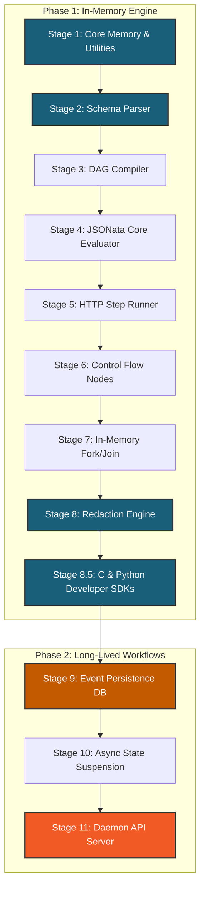

# nestor Orchestration Engine: Phased Technical Implementation Roadmap

- **Version:** 2.0.0 (Final Draft)
- **Author:** Core Architecture Group
- **Subject:** Vertical Slice Implementation & Test Harness Specification

---

## 1. Introduction & Implementation Strategy

This document defines the technical roadmap for the `nestor` Orchestration Engine. To ensure high quality, stability, and continuous integration, the project is divided into two distinct phases:
- **Phase 1: In-Memory Engine (CLI Mode / Stateless Ephemeral Pipeline):** Establishes the core data structures, compiler, in-memory expression evaluation, step runners, and control flow.
- **Phase 2: Long-Lived Workflows (Server Mode / Stateful Persistent Engine):** Builds persistence, asynchronous state serialization, daemon servers, and correlation events.

### 1.1 Cache Optimization Strategy
To optimize LLM token usage and leverage **LLM Context Cache Hits**, features are ordered strictly from **least likely to change** (foundational leaf structures) to **most likely to change** (high-level network daemons). 



*Foundational Phase 1 layers (Blue) will stabilize early. They will remain completely static and serve as cached context prefixes in downstream LLM prompts when implementing Phase 2 components (Orange).*

---

## 2. Technical Stack & Verification Rules

Every stage includes a formal verification step. Before proceeding to the next stage, the engineer or agent must:
1. Compile using the developer options:
   ```bash
   OPTION=dev make all
   ```
2. Validate against memory leaks and invalid accesses:
   ```bash
   valgrind --leak-check=full --show-leak-kinds=all --track-origins=yes ./nestor [testargs]
   ```
3. Ensure no standard allocation (`malloc`, `free`, `realloc`, `calloc`) is linked in the internal engine objects.

---

## 3. Phase 1: In-Memory Engine (Stateless CLI)

Phase 1 focuses entirely on CLI execution mode. It parses YAML from standard input, compiles the DAG, runs tasks sequentially and concurrently in RAM, and immediately exits. Encountering a blocking wait boundary in this phase throws `ERR_CLI_UNSUPPORTED_BLOCKING_NODE`.

---

### Stage 1: Core Memory Management & Bit-Packed Utilities

#### Objective
Establish the strict allocation boundaries and bitwise helpers used throughout the execution lifecycle. Zero dynamic heap allocation is permitted.

#### Files & Structures
- `src/include/arena.h` & `src/comm/utils/arena.c`: Chained Arena Allocator.
- `src/include/stringview.h` & `src/comm/utils/stringview.c`: Length-delimited string operations.
- `src/include/bitstack.h` & `src/comm/utils/bitstack.c`: Bit-packed execution state stack.

#### Detailed Steps
1. Implement `arena_init(Arena* arena, size_t chunk_size)` and `arena_alloc(Arena* arena, size_t size)`. Ensure allocations are 8-byte aligned.
2. Implement `arena_reset(Arena* arena)` which resets offsets without releasing chunks back to the OS, enabling fast reuse.
3. Write `StringView` helpers: `sv_compare`, `sv_starts_with`, `sv_find_char`, and `sv_to_cstring` (only used for third-party libraries requiring null-termination).
4. Implement `BitStack`: Pack boolean states and execution status into integer stacks. Ensure OOM/overflow boundaries are handled without crashing.

#### E2E Verification
Write `tests/test_stage1.c`:
- Allocate 100 blocks of various sizes across chunk boundaries; verify memory alignment is strictly 8-byte aligned.
- Reset the arena; verify offsets are cleared and blocks can be re-allocated.
- Run under Valgrind to ensure zero leaks.
```bash
./bin/test_stage1
```

---

### Stage 2: Schema Parser & AST Construction (`jsonv` Bridge)

#### Objective
Configure `jsonv` to use the Custom Arena Allocator, parse YAML/JSON from standard input, and extract workflow root metadata without memory duplication.

#### Files & Structures
- `src/include/parser.h` & `src/comm/struct/parser.c`
- `src/include/ast.h`

#### Detailed Steps
1. Set up memory overrides for `jsonv` using our Arena allocator callbacks.
2. Load a YAML file from `stdin` into a continuous buffer.
3. Parse the buffer using `jsonv` to produce an AST.
4. Extract `version`, `name`, and global `env` keys as `StringView` structures mapping directly to the buffer. Verify version follows semantic versioning.

#### E2E Verification
Write `tests/test_stage2.c`. Pipe a valid workflow YAML:
```yaml
version: 2.0.0
name: Test Onboarding Pipeline
on: { manual: {} }
env:
  GLOBAL_URL: "https://api.internal"
jobs: {}
```
Command:
```bash
./bin/test_stage2 < tests/fixtures/simple.yaml
```
Verify the output displays parsed root fields with matching pointer locations inside the source buffer, proving zero-copy extraction.

---

### Stage 3: DAG Compiler & Kahn's Sorting

#### Objective
Construct the intrusive Job DAG from the parsed JSON/YAML structure, detect cycles, and establish the topological execution path.

#### Files & Structures
- `src/include/compiler.h` & `src/comm/struct/compiler.c`

#### Detailed Steps
1. Parse the `jobs` mapping. For each key, instantiate a `JobNode` inside the Arena.
2. Build the dependency array `depends_on` by referencing target job nodes.
3. Implement **Kahn's Algorithm** for topological sorting:
   - Identify nodes with zero incoming dependencies.
   - Iteratively remove nodes from graph and push them onto `next_sorted` lists.
4. If the graph contains cycles, immediately return `ERR_CYCLIC_DEP`.
5. Validate that all referenced dependency job IDs exist in the root schema (`ERR_MISSING_VAR` if missing).

#### E2E Verification
Create `tests/fixtures/cyclic.yaml` containing a cyclic depend (e.g., Job A depends on B, B depends on A).
```bash
./bin/test_stage3 < tests/fixtures/cyclic.yaml
# Should print ERR_CYCLIC_DEP and exit with code 1.
```
Create a valid multi-branch workflow. Verify topological sort prints:
```
Sorted execution order: validate_payload -> check_tier -> deploy_standard -> notify_success
```

---

### Stage 4: JSONata Integration & Core Expression Evaluator

#### Objective
Evaluate `${{ ... }}` expressions dynamically against a context JSON document using the `jsonata` C library.

#### Files & Structures
- `src/include/evaluator.h` & `src/comm/utils/evaluator.c`

#### Detailed Steps
1. Instantiate the JSONata evaluation engine structure.
2. Build a JSON context object merging `inputs` and `env` maps.
3. Extract text inside `${{` and `}}` using `StringView` boundaries.
4. Bind native functions (`$toLower`, `$contains`, `$toJSON`, `$fromJSON`) to the JSONata runtime environment.
5. Evaluate expression; resolve and output the result. If evaluation yields null for a required property, return `ERR_MISSING_VAR`.

#### E2E Verification
Pass a JSON payload and an expression to the compiler evaluator:
```c
// JSON context: {"inputs": {"user_id": "Sebastien"}, "env": {"ENV_VAR": "production"}}
// Expression: "inputs.user_id & '-' & env.ENV_VAR"
```
Verify the output string evaluates to `"Sebastien-production"`. Ensure zero leaks inside the JSONata evaluation scope.

---

### Stage 5: HTTP Native Step Runner

#### Objective
Enable `task` nodes to execute step sequences containing native `http` blocks using `libcurl`.

#### Files & Structures
- `src/include/runner.h` & `src/comm/struct/runner.c`
- `src/comm/utils/http.c`

#### Detailed Steps
1. Implement the step loop within `task` nodes.
2. Integrate `libcurl` configured to direct its internal memory calls to the Arena.
3. Resolve HTTP target URLs, methods, headers, and bodies dynamically using the Stage 4 evaluator.
4. Execute HTTP calls synchronously.
5. Extract the HTTP response code, headers, and body. Parse the response body into JSON via `jsonv` and bind it to the step-level outputs: `steps.<step_id>.outputs.body`.

#### E2E Verification
Write a mock pipeline executing against a local server or public endpoint (`httpbin.org`):
```yaml
version: 2.0.0
name: Single Task Http Pipeline
on: { manual: {} }
jobs:
  run_http:
    type: task
    steps:
      - id: get_ip
        http:
          method: GET
          url: "https://httpbin.org/ip"
```
Execute the workflow. Verify the exit code is `0` and outputs are parsed correctly.

---

### Stage 6: Control Flow Nodes (If, Switch, Loops)

#### Objective
Support structural routing nodes (`if`, `switch`, `loop`) without side-effects, dynamically updating the active execution path in memory.

#### Files & Structures
- `src/comm/struct/control_flow.c`

#### Detailed Steps
1. **`if` node:** Evaluate `condition`. If true, mark the jobs in the `else` array as `SKIPPED` in the state array and enqueue `then` jobs.
2. **`switch` node:** Evaluate `cases`. Route to the first expression evaluating to `true`.
3. **`loop` node:**
   - For `while` loops, check `condition`. If true, execute internal steps sequentially in memory.
   - For `for_each` loops, evaluate `items` using JSONata, and iterate steps mapping the element to the local variable context.
   - Enforce `max_iterations` constraints. If reached, abort with `ERR_LOOP_MAX_ITERATIONS`.

#### E2E Verification
Run a loop workflow fixture:
```yaml
jobs:
  poll_status:
    type: loop
    loop_type: while
    condition: ${{ steps.check.outputs.body.status != "READY" }}
    max_iterations: 3
    steps:
      - id: check
        http:
          method: GET
          url: "https://httpbin.org/json"
```
Ensure it stops after 3 iterations (or when condition resolves to false) and does not leak memory.

---

### Stage 7: Concurrency Engine (In-Memory Fork & Join)

#### Objective
Handle parallel branching paths and barrier synchronization policies in CLI Mode.

#### Files & Structures
- `src/comm/struct/concurrency.c`

#### Detailed Steps
1. **`fork` node:** Spawns concurrent evaluation blocks for all specified target branches.
   - In CLI Mode, parallelize HTTP request executions within fork branches by multiplexing handles via `curl_multi`.
2. **`join` node:** Act as a synchronization barrier. Compare upstream dependencies against in-memory execution state.
   - `all`: All inputs must resolve successfully.
   - `any`: Resume as soon as one dependency finishes.
   - `n_required`: Resume when $N$ inputs finish.

#### E2E Verification
Run a workflow containing a fork splitting into three parallel HTTP requests, converging at a join node with strategy `any`. Validate that the downstream step executes as soon as the fastest request completes.

---

### Stage 8: Observability & Secrets Redaction (Aho-Corasick)

#### Objective
Intercept logs and stdout, redacting variables originating from the `${{ secrets.NAME }}` context.

#### Files & Structures
- `src/include/aho_corasick.h` & `src/comm/utils/redactor.c`

#### Detailed Steps
1. Implement the Aho-Corasick tree construction using Arena memory.
2. Compile all active secret string values under the current runner execution context into the state machine.
3. Write a stream filter function `redact_stream(const char* input, char* output, size_t length)`.
4. Replace matches with `***` in-place.

#### E2E Verification
Register two secrets: `"SECRET_TOKEN"` and `"PA$$WORD"`. Write log messages:
`"Sending request with Authorization: Bearer SECRET_TOKEN to access database using PA$$WORD."`
Verify the output streams as:
`"Sending request with Authorization: Bearer *** to access database using ***."`

---

### Stage 8.5: Developer SDKs for C and Python Plugins

#### Objective
Provide standardized C and Python SDK libraries (`nestor_plugin.h` and `nestor_plugin.py`) to simplify plugin development, abstraction of IPC socket queries, environment parsing, and result serialization.

#### Files & Structures
- `plugins/sdk/c/include/nestor_plugin.h` & `plugins/sdk/c/src/nestor_plugin.c`
- `plugins/sdk/python/nestor_plugin.py`

#### Detailed Steps
1. **C SDK (`nestor_plugin.h`):**
   - Implement `np_get_input_json()`: Reads the parsed input parameters from the path provided in the `NESTOR_PLUGIN_INPUT` environment variable.
   - Implement `np_get_env()`: Reads the context environment from `NESTOR_ENV`.
   - Implement `np_success(const char *json_body)` and `np_error(int code, const char *err_msg)`: Output formatting functions that stream structured results to stdout.
   - Implement a dynamic context queries wrapper API (over the UNIX socket specified in `NESTOR_SOCKET`).
2. **Python SDK (`nestor_plugin.py`):**
   - Provide a class `NestorPlugin`.
   - Implement `get_input()` and `get_env()` helper methods to read and parse environment variable JSON streams.
   - Implement `success(data)` and `error(code, message)` helper methods to write outcome payloads back to the host process.
   - Implement dynamic socket communication wrappers.

#### E2E Verification
Write test scripts using both C and Python SDKs. Verify they compile and run, correctly processing inputs and environment variables, communicating dynamically with the engine over Unix sockets, and exiting with appropriate stdout outputs.

---

### Stage 8.7: SQLite-Backed Cache & Eviction Strategy

#### Objective
Implement an SQLite-backed caching system for job outputs that respects HTTP cache headers and uses a hybrid TTL and LRU eviction policy.

#### Files & Structures
- `src/include/cache.h` & `src/comm/struct/cache.c`

#### Detailed Steps
1. Configure SQLite in WAL mode with a 5000ms busy timeout.
2. Implement SHA-256 key hashing from job type, inputs, and environment context.
3. Write lookup code parsing HTTP cache headers (`Cache-Control`, `Expires`, `ETag`, `Last-Modified`).
4. Implement eviction routines:
   - TTL prune query: `DELETE FROM nestor_cache WHERE expires_at < NOW` on writes.
   - LRU prune query: delete oldest entries based on `last_accessed_at` when the table count exceeds `max_cache_entries`.

#### E2E Verification
Run tests caching mock HTTP response payloads. Verify that subsequent identical requests retrieve cached JSON from SQLite directly. Simulate cache saturation and verify that older records are evicted based on last access timestamps.

---

### Stage 8.8: Edge-Based Conditional execution

#### Objective
Incorporate Synapse-inspired edge execution conditions in the DAG compiler and runner scheduler loops.

#### Files & Structures
- `src/include/ast.h`
- `src/comm/struct/compiler.c`
- `src/comm/struct/runner.c`

#### Detailed Steps
1. Extend `depends_on` parsing in `compiler.c` to accept string/object dependencies and map them into the `JobNode` structures.
2. Store condition bitmasks (`onSuccess`, `onFailure`, `onSkip`, `onCompletion`) in a compact `uint8_t` array parallel to dependency pointers.
3. Rewrite the scheduler readiness checker to perform bitwise state evaluation and propagate skipped states downstream.

#### E2E Verification
Define a DAG where Job C runs `onFailure` of Job A and Job D runs `onSkip` of Job B. Trigger a failure in Job A and verify that Job C executes while other success-dependent jobs are skipped correctly.

---

### Stage 8.9: Native JSONata transform Job

#### Objective
Implement the zero-copy, in-process native `transform` node.

#### Files & Structures
- `src/comm/struct/runner.c`

#### Detailed Steps
1. Parse the `transform` node type and compile the inline JSONata expression.
2. In the runner loop, invoke the JSONata engine directly using the active thread's current `Arena` context.
3. Write query output back into the job outcomes workspace without process boundary transitions.

#### E2E Verification
Execute a workflow defining a `transform` job filtering and mapping an upstream task's outputs using JSONata. Verify the returned JSON is correct and that zero heap memory allocations are made outside the active Arena.

---

### Stage 8.10: Dynamic Plugin SDK & Subprocess Sandboxing

#### Objective
Implement dynamical shared-library plugins and the `sandboxed` subprocess execution wrapper.

#### Files & Structures
- `src/include/plugin.h` & `src/comm/struct/plugin.c`

#### Detailed Steps
1. Write dynamic loader routines using `dlopen` / `dlsym` resolving the stable C ABI structure (`NestorPluginAPI` / `NestorHostAPI`).
2. Pass host-managed `Arena` pointers to loaded dynamic plugins for memory allocation control.
3. Write subprocess isolation runner executing dynamic plugins in a separate process space when `"sandboxed": true` is set.

#### E2E Verification
Load a dynamic library plugin in-process. Verify it queries variables and returns outputs successfully. Set `"sandboxed": true` on a second plugin run, trigger a segmentation fault in the plugin binary, and verify that the host engine catches the subprocess crash gracefully and propagates a failure code.

---


## 4. Phase 2: Long-Lived Workflows (Stateful Server)

Phase 2 transitions the engine to Server Mode. Workflows are deployed via API, state transitions are logged to an event-sourced SQL database, and asynchronous boundaries pause runs until correlation signals or timers arrive.

---

### Stage 9: Event-Sourced Database Persistence

#### Objective
Incorporate SQLite (or PostgreSQL) connectivity. Create schemas to store running instances, events, signals, and dynamic contexts.

#### Files & Structures
- `src/include/db.h` & `src/comm/struct/db.c`

#### Detailed Steps
1. Establish DB setup scripts. Initialize SQLite databases using our Custom Arena memory allocators.
2. Write helper functions:
   - `db_init()`: Set up tables (`workflow_runs`, `execution_events`, `correlation_signals`).
   - `db_record_event(const char* run_id, const char* job_id, const char* event_type, const char* context_json)`: Writes transition events.
3. Verify transaction isolation and performance metrics under multi-threaded queries.

#### E2E Verification
Run a test routine inserting 1,000 state transition events concurrently. Query the DB and ensure sequential integrity and zero memory leaks.

---

### Stage 10: Asynchronous State Suspension & Correlation Resuming

#### Objective
Handle `wait_signal` and `wait_timer` boundaries by serializing state to the DB, releasing workers, and resuming from correlation events.

#### Files & Structures
- `src/comm/struct/async_boundary.c`

#### Detailed Steps
1. **`wait_timer` node:** Write a background timer loop. Store the target wake-up time in the DB, suspend worker, and resume execution upon expiration.
2. **`wait_signal` node:**
   - Execute initial steps in `wait_signal` (before suspend).
   - Serialize the active context (inputs, needs, step variables) into a JSON string using `jsonv`.
   - Write state (`WORKFLOW_SUSPENDED`) and add record to `correlation_signals` indexing `correlation_id`.
   - Release task threads.
3. Write context-reloading routine: reconstruct DAG state from DB, merge with signal correlation payloads, and resume topologically.

#### E2E Verification
Run a workflow containing a `wait_signal` expecting `correlation_id: "order-100"`.
Verify execution pauses and database state reflects suspension. Call the internal correlation loader with payload `{"correlation_id": "order-100", "payload": {"status": "PAID"}}`. Confirm the workflow loads variables and completes successfully.

---

### Stage 11: Daemon API & Coordination Daemon (`libmicrohttpd`)

#### Objective
Expose workflow controls (deploy, trigger, signal) via HTTP endpoints and implement graceful coordinator shutdown/restart logic.

#### Files & Structures
- `src/include/daemon.h` & `src/comm/struct/daemon.c`
- `src/main.c` (Support `--server` commands)

#### Detailed Steps
1. Start `libmicrohttpd` listening on configured ports.
2. Implement routing handlers:
   - `POST /v1/workflows/deploy`
   - `POST /v1/workflows/trigger`
   - `POST /v1/workflows/signal`
3. Link endpoints to the execution compiler and resuming engines.
4. Implement graceful `SIGTERM` handlers to release database locks and persist state of in-flight executions before daemon termination.

#### E2E Verification
Deploy, trigger, and signal workflows exclusively using API requests. Kill the daemon mid-execution, restart it, and verify graceful recovery of all pending/interrupted workflow jobs.
