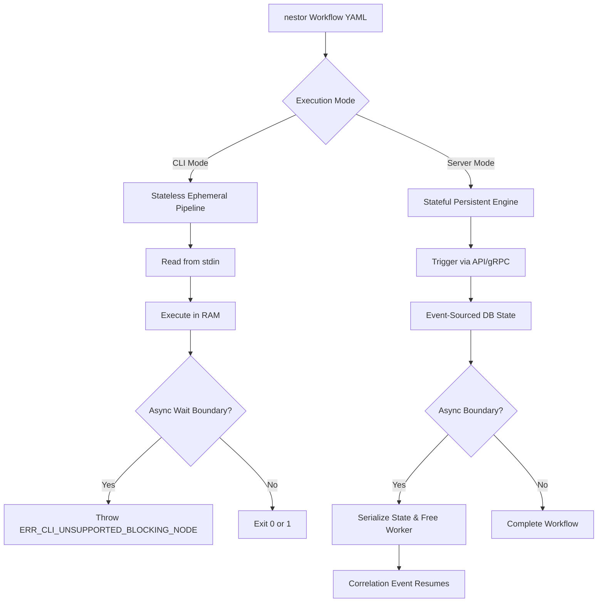
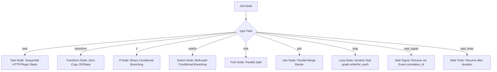

# nestor Orchestration Engine: Configuration Language Specification

- **Version:** 2.0.0 (Final Draft)
- **Author:** Core Architecture Group
- **Subject:** Formal Technical Specification for API & Service Orchestration Configuration

---

## Table of Contents
1. [Architectural Overview & Execution Modes](#1-architectural-overview--execution-modes)
2. [Document Structure & Root Schema](#2-document-structure--root-schema)
3. [Graph Node Taxonomy (The Type System)](#3-graph-node-taxonomy-the-type-system)
4. [Execution Semantics & Topologies](#4-execution-semantics--topologies)
5. [Actions: HTTP & Plugins](#5-actions-http--plugins)
6. [Variables, Expressions & Contexts](#6-variables-expressions--contexts)
7. [State, Inputs, and Outputs](#7-state-inputs-and-outputs)
8. [Error Handling & Policies](#8-error-handling--policies)
9. [Security](#9-security)
10. [Data Types](#10-data-types)
11. [Edge Cases & Validation Rules](#11-edge-cases--validation-rules)
12. [Complete Use-Case Examples](#12-complete-use-case-examples)

---

## 1. Architectural Overview & Execution Modes

The **nestor** orchestration engine is designed for high-performance API and Service Orchestration. It models execution as a Directed Acyclic Graph (DAG) using a YAML-based configuration language.

> [!IMPORTANT]
> **Design Directive:** Container orchestration (e.g., Docker/Kubernetes) and arbitrary shell executions are deprecated in favor of native HTTP operations and a specialized plugin architecture. This minimises runner footprint, overhead, and latency.

To support both local development/testing and enterprise business processes (BPMN-like capabilities), the engine operates in two distinct execution modes:



### 1.1 CLI Mode (Stateless Ephemeral Pipeline)
- **Lifecycle:** Reads YAML from standard input, validates, executes in memory, and exits with code `0` or `1`.
- **State:** Entirely ephemeral (RAM-resident).
- **Blocking Behavior:** Encountering an asynchronous wait boundary (e.g., waiting for an API webhook resume or a timer) throws `ERR_CLI_UNSUPPORTED_BLOCKING_NODE` and immediately halts execution to prevent indefinite local thread locking.

### 1.2 Server Mode (Stateful Persistent Engine)
- **Lifecycle:** Runs as a long-lived HTTP/gRPC orchestrator. Workflows are deployed, and runs are triggered via API.
- **State:** Persistent. Every state transition is committed to an event-sourced database.
- **Blocking Behavior:** When an asynchronous boundary is reached, the execution state is serialized to the database, freeing worker threads. The workflow resumes only when an external correlation event occurs.

---

## 2. Document Structure & Root Schema

The configuration format uses **YAML 1.2**. A single file defines exactly one workflow.

| Field | Type | Required | Default | Description | Validation Rules |
| :--- | :--- | :--- | :--- | :--- | :--- |
| `version` | `string` | **Yes** | - | Schema version identifier (e.g., `2.0.0`). | Must follow semantic versioning. |
| `name` | `string` | **Yes** | - | Workflow display name. | Max 128 characters. |
| `on` | `object` | **Yes** | - | Event triggers defining how the workflow starts. | Must contain at least 1 trigger. |
| `env` | `map` | No | `{}` | Global environment variables. | Keys must match `^[a-zA-Z_]+$`. |
| `jobs` | `map` | **Yes** | - | Map of execution nodes in the DAG. | Keys must be valid Job IDs. |

---

## 3. Graph Node Taxonomy (The Type System)

The graph relies on distinct node archetypes defined by the `type` field at the job level. This taxonomy provides native support for complex BPMN-style routing and iterations.



### 3.1 Task Nodes (Action Nodes)
- **`task` (Default):** Executes concrete operations sequentially. Contains a list of `steps` which map to `http` blocks or utilize plugins.

### 3.1.2 Transform Nodes (Action Nodes)
- **`transform`:** Executes an in-process, zero-copy JSONata expression. Contains an `expression` parameter representing the query/transformation to perform on the context JSON.

### 3.2 Control Flow Nodes (Structural Nodes)
These nodes dictate the routing and iteration of the graph without performing external system side-effects.
- **`if` (Exclusive Gateway - Binary):** Evaluates a boolean `condition` to direct flow to either a `then` or `else` branch (lists of downstream Job IDs).
- **`switch` (Exclusive Gateway - Multi-path):** Evaluates multiple expressions to select exactly one execution branch. Contains a list of `cases` (each with a `condition` and `then` Job IDs list) and an optional `default` branch.
- **`fork` (Parallel Gateway - Split):** Explicitly splits the execution path into multiple concurrent branches (`branches` list of Job IDs).
- **`join` (Parallel Gateway - Merge):** Acts as a synchronization barrier, waiting for multiple upstream branches based on a defined strategy (`all`, `any`, `n_required`).
- **`loop` (Iterative Node):** Executes a sub-graph or an inline set of steps iteratively. Supports `while` (condition-based) and `for_each` (collection-based) iterations.

### 3.3 Event & Wait Nodes (Asynchronous Boundaries)
- **`wait_signal`:** Suspends the workflow instance until an external API payload matching a `correlation_id` is received. Can optionally execute initial `steps` before suspending.
- **`wait_timer`:** Suspends the workflow instance for a fixed duration.

---

## 4. Execution Semantics & Topologies

- **Sequential Execution & Conditional Dependencies:** Controlled via the `depends_on` array. Nestor supports edge-based conditional dependencies. A dependency can be defined as:
  *   A plain string, representing an implicit `onSuccess` condition.
  *   An object specifying the parent `job` and an array of `conditions` (values: `onSuccess`, `onFailure`, `onCompletion`, `onSkip`).
  
  *Downstream Execution Rules:*
  *   A job is evaluated when all its dependencies have reached a terminal state (`STATE_SUCCEEDED`, `STATE_FAILED`, or `STATE_SKIPPED`).
  *   A job runs only if all its incoming dependency conditions are satisfied. If any condition is unsatisfied, the job is marked as `STATE_SKIPPED` and skipped state propagates downstream.
  
- **Explicit Forking (`type: fork`):** While `depends_on` can implicitly branch paths, the `fork` node makes parallel branch intentions explicit, allowing the engine to allocate worker threads proactively.
- **Advanced Synchronization (`type: join`):** The `join` node allows complex merge conditions. The merge condition is evaluated based on its `strategy` (`all`, `any`, `n_required`) over satisfied incoming edges.
- **Bounded Loops (`type: loop`):** To prevent infinite execution blocking engine resources, all `while` loops must define a `max_iterations` integer limit. Exceeding this limit results in a node failure (`ERR_LOOP_MAX_ITERATIONS`).
- **Cycles:** Except for the isolated execution within a `loop` node, the overall job topography remains a Directed Acyclic Graph (DAG). The compiler utilizes Kahn's algorithm; cyclic job dependencies result in an `ERR_CYCLIC_DEP` compilation failure.


---

## 5. Actions: HTTP & Plugins

### 5.1 Native HTTP Action
The `http` block treats REST/HTTPS calls as first-class citizens.

| Field | Type | Required | Description |
| :--- | :--- | :--- | :--- |
| `method` | `string` | **Yes** | `GET`, `POST`, `PUT`, `PATCH`, `DELETE`. |
| `url` | `string` | **Yes** | Target endpoint. Supports expression interpolation. |
| `headers` | `map` | No | HTTP headers. |
| `body` | `any` | No | Payload. Automatically serialized to JSON for maps/lists. |
| `timeout` | `duration` | No | Request timeout (Default: `30s`). |
| `mtls_profile` | `string` | No | Reference to a runner-configured mutual TLS certificate profile. |

### 5.2 Plugin Action
Plugins handle complex integrations (e.g., LDAP/Active Directory, gRPC, custom enterprise SDKs).

| Field | Type | Required | Description |
| :--- | :--- | :--- | :--- |
| `uses` | `string` | **Yes** | Registry identifier (e.g., `nestor-plugins/active-directory@v2`). |
| `with` | `map` | No | Key-value arguments conforming to the plugin's schema. |
| `sandboxed` | `boolean` | No | If `true`, executes the plugin in a separate process space for security boundary isolation (default: `false`). |


---

## 6. Variables, Expressions & Contexts (JSONata Integration)

All expressions inside a workflow configuration utilize the `${{ ... }}` syntax and are evaluated at runtime using the **JSONata** query and transformation language. 

JSONata acts as the query engine to extract, transform, and evaluate data against the current workflow context.

### Context Precedence & Structure
When evaluating a JSONata expression, the engine passes a single merged JSON context object as the root scope. Variable resolution precedence from highest to lowest is:
1. Step-level environment: `env`
2. Job-level environment: `env`
3. Workflow-level environment: `env`
4. Runner environment
5. Secrets: `secrets`

The root JSON context available to JSONata expressions contains:
```json
{
  "inputs": { ... },       // Incoming workflow triggers inputs
  "env": { ... },          // Resolved environment variables
  "secrets": { ... },      // Redacted secret keys (resolved at evaluation time)
  "needs": {               // Outputs from previous jobs that this job depends on
    "<job_id>": {
      "outputs": {
        "status": 200,
        "body": { ... },
        "headers": { ... }
      }
    }
  },
  "steps": {               // Outputs of previous steps in the current task
    "<step_id>": {
      "outputs": {
        "status": 200,
        "body": { ... },
        "headers": { ... }
      }
    }
  }
}
```

### Expression Capabilities
Since the engine embeds a full JSONata interpreter, workflows can use any standard JSONata features, including:
- **Path Navigation:** Select nested properties cleanly: `${{ needs.fetch_targets.outputs.body.symbols }}`
- **Boolean & Comparisons:** standard comparison operators: `&&`, `||`, `!`, `=`, `!=`, `<`, `>`, `<=`, `>=`.
- **Conditional Logic:** Ternary operator `cond ? then : else` (e.g., `${{ inputs.tier = "enterprise" ? "high" : "low" }}`).
- **String Manipulations:** String concatenation `str1 & str2` and transformation functions.
- **Array Processing & Filtering:** Filter collections using `[` predicates, e.g. `${{ steps.users.outputs.body[active = true].id }}`.
- **Object Transformations:** Reshape JSON outputs dynamically using JSONata constructors.
- **Null Coalescing:** Support for fallbacks, e.g. `${{ outputs.body.data ? outputs.body.data : 'fallback_value' }}`.

### Standard & Custom Functions
Workflows have access to all standard JSONata functions (e.g., `$contains`, `$lowercase`, `$uppercase`, `$string`, `$number`, `$join`, `$split`) and native JSONata custom extensions:
- `$contains(arr, val)`: Returns `true` if array contains a specific value (alias to `$contains` standard function).
- `$toLower(str)`: Converts string to lowercase (alias to `$lowercase`).
- `$toJSON(obj)`: Converts a JSON object to a string representation.
- `$fromJSON(str)`: Parses a JSON-formatted string into a structured JSON object.

---

## 7. State, Inputs, and Outputs

State is strictly structured JSON data passed explicitly through contexts.

| Scope | Mechanism | Description |
| :--- | :--- | :--- |
| **HTTP Body** | `needs.<job_id>.outputs.body` | The parsed JSON response body. |
| **HTTP Status** | `needs.<job_id>.outputs.status` | Integer HTTP response code (e.g., `201`). |
| **HTTP Headers** | `needs.<job_id>.outputs.headers` | Map of response headers. |
| **Plugin Outputs** | `needs.<job_id>.outputs.<key>` | Strongly typed outputs defined by plugin schemas. |
| **Wait Payload** | `needs.<job_id>.outputs.signal_payload` | The JSON payload submitted when resuming a `wait_signal`. |

---

## 8. Error Handling & Policies

Resilience is defined per job.

| Field | Type | Default | Description |
| :--- | :--- | :--- | :--- |
| `retry.max_attempts` | `integer` | `1` | Number of attempts before marking as failed. |
| `retry.backoff.type` | `enum` | `linear` | Progression algorithm: `linear` or `exponential`. |
| `retry.backoff.delay` | `duration` | `0s` | Initial delay before retrying. |
| `continue_on_error` | `boolean` | `false` | If `true`, downstream jobs execute even if this fails. |

---

## 9. Security

- **Secret Management:** Secrets are injected via `${{ secrets.NAME }}`. They are never written to state databases and are automatically redacted from observability logs using Aho-Corasick stream matching.
- **Authorization:** Runner authentication profiles handle generic OAuth2/mTLS at the system level to keep workflow definitions clean.

---

## 10. Data Types

- **`string`:** e.g., `"text"`
- **`integer`:** e.g., `42`
- **`float`:** e.g., `3.14`
- **`boolean`:** `true` or `false`
- **`null`:** `null`
- **`list`:** e.g., `[1, 2, 3]`
- **`map`:** e.g., `{ key: "value" }`
- **`duration`:** e.g., `"30s"`, `"24h"`, `"7d"`

---

## 11. Edge Cases & Validation Rules

- **Missing Variables:** Unresolved variables yield `null`. If a required field evaluates to `null`, compilation throws `ERR_MISSING_VAR`.
- **API Timeout Violations:** If a `wait_signal` node exceeds its timeout configuration, the engine abandons the wait, flags the node as `TIMED_OUT`, and triggers failure compensation paths.
- **Process Interruption (Server Mode):** On `SIGTERM`, running tasks release database locks. The coordinator reassigns them upon reboot, respecting idempotency constraints.
- **Process Interruption (CLI Mode):** Execution drops immediately. No state is saved.
- **Single Entry Point (Root Validation):** A workflow must have exactly one start job. This can be explicitly declared via `"start": true` on a job, or implicitly inferred if only one root node exists. Having multiple start jobs or un-resolvable root paths triggers a compilation error.
- **Joined Concurrency (Join Dominance):** If parallel branches are spawned using a `fork` job, all branches of that fork must be synchronized by a `join` job before reaching any exit job (marked `"end": true` or `"return"`) to avoid dangling process race conditions.
- **Deterministic Exit Nodes:** Any job node can be marked as an exit using `"end": true` (returns the job's outcomes) or `"return": <expression>` (evaluates and returns a custom mapped outcome), immediately terminating the workflow.

---

## 12. Complete Use-Case Examples

### Example 1: Polling with Loop Node (Stateful Iteration)

```yaml
version: 2.0.0
name: External Resource Provisioning
on:
  webhook:
    path: /v1/triggers/provision

jobs:
  # Trigger the external system via HTTP
  request_provisioning:
    type: task
    steps:
      - id: init
        http:
          method: POST
          url: "https://cloud.internal/api/provision"
          body:
            type: "database"

  # Loop node that waits and checks status until ready
  poll_status:
    type: loop
    depends_on: [request_provisioning]
    loop_type: while
    # Continue looping as long as status is not 'ACTIVE'
    condition: ${{ steps.check_api.outputs.body.status != 'ACTIVE' }}
    max_iterations: 60
    steps:
      - type: wait_timer
        duration: 10s
      - id: check_api
        http:
          method: GET
          url: "https://cloud.internal/api/status/${{ needs.request_provisioning.outputs.body.resource_id }}"
```

### Example 2: Complex Control Flow (Fork, Join, If, Else)

```yaml
version: 2.0.0
name: Multi-Region Deployment Orchestration
on:
  manual: {}

jobs:
  # 1. Start the process
  validate_payload:
    type: task
    steps:
      - http:
          method: POST
          url: "https://ci.internal/api/validate"
          body: ${{ inputs }}

  # 2. Binary If/Else branch
  check_tier:
    type: if
    depends_on: [validate_payload]
    condition: ${{ inputs.tier == 'enterprise' }}
    then: [split_enterprise_deploy]
    else: [deploy_standard]

  # 3. Standard Deployment Path
  deploy_standard:
    type: task
    steps:
      - http:
          method: POST
          url: "https://deploy.internal/api/us-east-1"

  # 4. Enterprise Deployment Path - Fork into multiple regions
  split_enterprise_deploy:
    type: fork
    branches: [deploy_us, deploy_eu, deploy_apac]

  deploy_us:
    type: task
    steps:
      - http:
          method: POST
          url: "https://deploy.internal/api/us"

  deploy_eu:
    type: task
    steps:
      - http:
          method: POST
          url: "https://deploy.internal/api/eu"

  deploy_apac:
    type: task
    steps:
      - http:
          method: POST
          url: "https://deploy.internal/api/apac"

  # 5. Synchronization Barrier - Wait for all regions to finish
  sync_regions:
    type: join
    depends_on: [deploy_us, deploy_eu, deploy_apac]
    # Strategy 'all' requires all upstream dependencies to complete successfully
    strategy: all

  # 6. Finalization runs only after the join succeeds
  notify_success:
    type: task
    depends_on: [sync_regions, deploy_standard]
    steps:
      - http:
          method: POST
          url: "https://hooks.slack.com/notify"
          body:
            text: "Deployment fully completed."

---

## 13. SQLite-Backed Caching
Nestor incorporates a local SQLite caching subsystem.
- **Deterministic Key**: A SHA-256 hash computed over the job type, specification parameters, resolved runtime inputs, and active environment context.
- **HTTP Cache Compliance**: HTTP jobs automatically respect `Cache-Control` directive headers (`max-age`, `no-cache`, `no-store`), `Expires` timestamps, and execute conditional validation (`ETag` with `If-None-Match`, `Last-Modified` with `If-Modified-Since`).
- **TTL Eviction Strategy**: Stale records are automatically ignored during lookups. A pruning routine deletes expired rows on every cache write transaction.
- **LRU Eviction Strategy**: Database size is capped at `max_cache_entries` rows. Write operations exceeding this limit trigger an LRU eviction, deleting the oldest records ordered by `last_accessed_at`.

## 14. CLI Flags & Precedence
Nestor supports runtime command-line configurations with a strict resolution hierarchy (highest overrides lowest):
1. **CLI Flags** (e.g., `--parallelism`, `--no-cache`, `--var`, `--secret`)
2. **Environment Variables** (prefixed with `NESTOR_`)
3. **Workflow-Specific Config** (configured at the workflow definition root)
4. **Global Configuration File** (`/etc/nestor/config.json` or `~/.nestor/config.json`)
5. **Engine Defaults**

```
