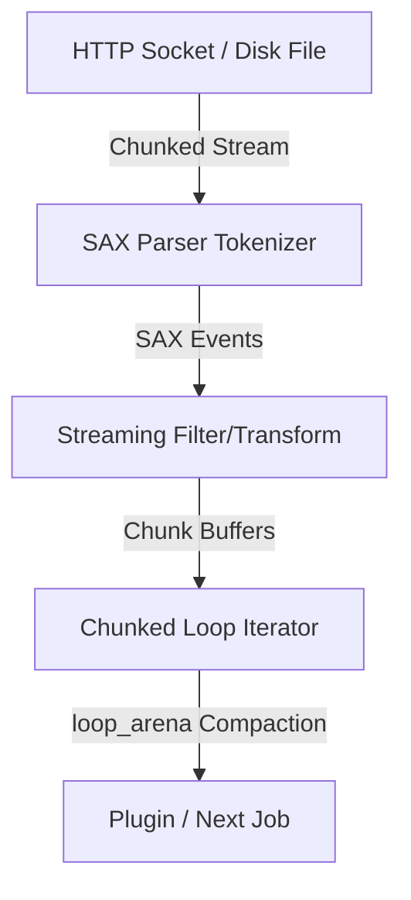

# Nestor Specification: Streaming Data Pipelines & Chunked Iterators (SPEC_STREAMING_BIGDATA_011)

## 1. Overview & Rationale

As Nestor is deployed in large-scale data environments, workflows must process payloads exceeding several gigabytes. The current Document Object Model (DOM) JSON parser (`jsonv`) and in-memory JSONata engine consume memory proportional to the size of the dataset ($O(N)$ scaling). This results in high memory overheads (8x–10x multiplier of the raw string size) and risks Out-Of-Memory (OOM) failures.

The objective of this specification is to introduce **Streaming Data Pipelines** and **Chunked Iterators**, enabling Nestor to compile and execute workflows with constant memory overhead ($O(1)$ RAM scaling) relative to dataset size.

---

## 2. Architectural Design

The streaming architecture is built on three core pillars:



### 2.1 Event-Driven SAX Tokenizer
Instead of materializing a full DOM tree:
*   Integrate a streaming tokenizer that reads input bytes from standard Unix streams, disk files, or sockets in fixed chunks (e.g. 64 KB).
*   The tokenizer triggers callback hooks for JSON tokens (e.g., `on_map_start`, `on_key`, `on_value`, `on_map_end`).
*   Intermediate state tracking uses a bit-packed state stack (conforming to `AGENTS.md` standards) to track nesting levels and current paths.

### 2.2 Chunked Loop Iterators
Introduce a new iterator mode for `NODE_LOOP` jobs to process large JSON arrays or line-delimited records sequentially:
*   The iterator reads a configurable block of records (e.g., 1000 items) from the source stream.
*   It exposes the current chunk as a local JSON array (`${{ chunk }}`) inside the loop execution context.
*   After the loop body completes the execution of steps for the current chunk, the scheduler invokes `loop_arena` compaction (freeing all scratch memories and reclaiming the chunk memory) before pulling the next block.

### 2.3 Pipe-Based Streaming Plugins
Introduce low-level stream transformations by piping raw bytes through subprocesses:
*   Nestor opens standard input and output pipes (`stdin`/`stdout`) to a sandboxed plugin.
*   Data is read from the source stream and pushed in small buffers directly through the write pipe.
*   The plugin processes the stream in C and writes back through the read pipe, completely bypassing any JSONata memory allocations.

---

## 3. Schema & Syntax Specifications

To support streaming, the workflow scenario schema will be updated with the following properties:

### 3.1 HTTP Stream Configuration
HTTP tasks can configure streaming mode:
```json
"fetch_dataset": {
  "type": "task",
  "steps": [
    {
      "id": "download",
      "http": {
        "method": "GET",
        "url": "https://api.example.com/bulk-data",
        "stream": true,
        "chunk_size": 65536
      }
    }
  ]
}
```

### 3.2 Chunked Loop Definition
Loops can iterate over stream outcomes:
```json
"process_chunks": {
  "type": "loop",
  "loop_type": "stream_chunk",
  "source": "jobs.fetch_dataset.steps.download.stream",
  "chunk_record_limit": 1000,
  "steps": [
    {
      "id": "process_record",
      "uses": "./plugins/record_processor",
      "with": {
        "records": "${{ chunk }}"
      }
    }
  ]
}
```

---

## 4. Memory Management & Safety Laws

The streaming architecture strictly complies with Nestor's core memory laws (defined in `AGENTS.md`):

1.  **Zero Heap Allocation**:
    *   No calls to `malloc` or `free`. All allocations for streaming buffers (e.g., the 64 KB read buffer) must be requested from the explicit `Arena *` passed to the step runner.
2.  **Bounded Arena Usage**:
    *   The buffer used by the SAX tokenizer is reused across reads via pointer resets.
    *   The `chunk` array and its constituent elements are allocated in the `loop_arena`. The scheduler calls `arena_destroy(loop_arena)` at the end of each iteration, releasing all compiled structures back to the system immediately.
3.  **Zero-Copy String Views**:
    *   The SAX tokenizer exposes keys and values as `StringView` pointers directly referencing the active 64 KB stream chunk buffer.
    *   If a plugin or step requires accessing a value, it must copy it to its own local arena segment or process it before the next stream read operation overwrites the buffer.

---

## 5. Implementation Roadmap

### Phase 1: SAX Parser Integration
*   Implement `sax_parser.c` and `sax_parser.h`.
*   Write unit tests to verify event callbacks and bit-packed nesting stack operations.

### Phase 2: HTTP Chunked Read Callback
*   Update `transport.c` to support `stream: true`.
*   Implement `my_transport_curl_write_callback` stream redirection.

### Phase 3: Loop Chunked Iterator
*   Implement `stream_chunk` loop executor in `runner.c`.
*   Integrate loop arena compaction check to assert $O(1)$ memory consumption.

### Phase 4: Verification
*   Create a mock big data file (e.g. 100 MB).
*   Run unit/E2E tests under AddressSanitizer and verify that memory usage remains flat throughout execution.

---

## 6. Required Modifications to External Libraries

To achieve true streaming evaluation, the external static libraries `jsonv` and `jsonata` must be modified as follows:

### 6.1 `jsonv` Library Enhancements
The `jsonv` library currently parses strings strictly into an in-memory DOM. It must be updated to export a low-level event tokenization interface:
*   **SAX Parser API**: Expose a new function `jsonv_parse_sax(const unsigned char *buffer, size_t length, const jsonv_sax_callbacks *callbacks, void *user_data)`.
*   **Zero-Copy Token Callbacks**: The callbacks struct `jsonv_sax_callbacks` must pass keys and values as length-delimited pointers referencing the input stream buffer directly without allocating C-string duplicates.

### 6.2 `jsonata` Library Enhancements
The C-JSONata engine compiles expressions and evaluates them against a fully built `Jsonata_Value` input tree. To process streams dynamically:
*   **Lazy Pull-Based Accessors**: Introduce custom key/index lookup callbacks within the `Jsonata_Value` struct. Instead of traversing a pre-built DOM tree, when JSONata evaluates a path like `jobs.fetch.body.size_mb`, it calls:
    ```c
    Jsonata_Value* (*get_property)(void* context, const char* key, size_t key_len);
    ```
    This allows Nestor to resolve values dynamically on-demand (e.g., pulling a specific slice from the sqlite cache or parsing a small chunk of a file) rather than maintaining the entire dataset in RAM.
*   **Streaming Expression Compilation**: Add support for compiling paths into stream filter state-machines, matching tokens directly as they are emitted by the `jsonv` SAX parser.

